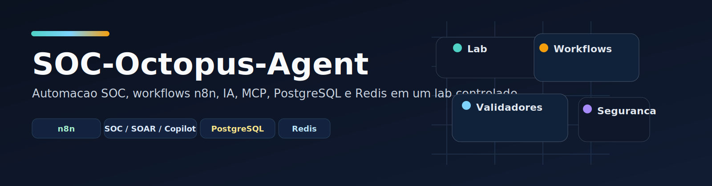
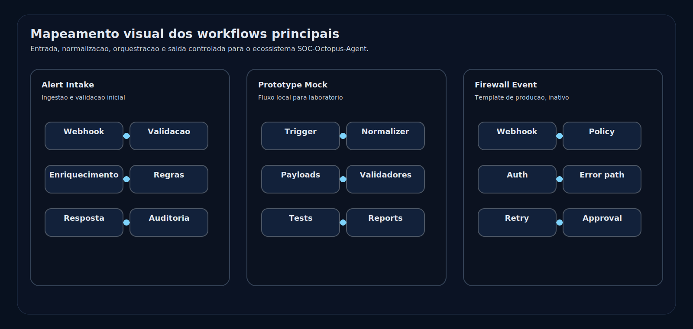
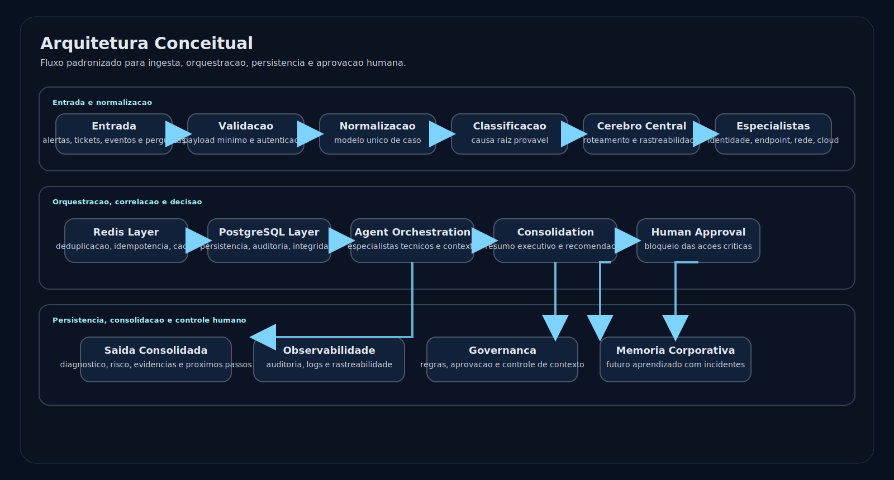

# SOC-Octopus-Agent

<p align="center">
  
</p>

Repositorio para automacao SOC, workflows n8n, agentes de IA, integracoes MCP, payloads mock, validadores locais e persistencia planejada em PostgreSQL/Redis.

## Status Atual

Este projeto e um prototipo controlado. Nao esta aprovado para execucao em producao.

Perfis principais:

- `mock-executable`: fluxos locais/mock com payloads sinteticos e sem credenciais reais.
- `lab-template`: workflows para importacao em laboratorio isolado com credenciais placeholder.
- `prod-template`: templates orientados a producao, sempre inativos, ainda dependentes de credenciais, validacao no n8n, testes de erro e aprovacao humana.

## Workflows Em Destaque

<p align="center">
  
</p>

| Workflow | Tipo | Arquivo |
| --- | --- | --- |
| Alert Intake | Ingestao e validacao inicial | `02-workflows-n8n/soc-investigation-copilot-v1-alert-intake.json` |
| Prototipo Mock | Fluxo base para laboratorio | `02-workflows-n8n/soc-octopus-prototipo-mock.json` |
| Evento Firewall Mock | Ingestao simulada de firewall | `02-workflows-n8n/soc-octopus-evento-firewall-mock.json` |
| Cloud IAM Permissao Mock | Enriquecimento de permissao | `02-workflows-n8n/soc-octopus-cloud-iam-permissao-mock.json` |

## Arquitetura

<p align="center">
  
</p>

Camadas principais:

- `Webhook Ingress`: entrada segura e validada.
- `Normalization Layer`: padronizacao do payload para analise.
- `Redis Layer`: deduplicacao, idempotencia e cache temporario.
- `PostgreSQL Layer`: persistencia estruturada e rastreabilidade.
- `Agent Orchestration`: roteamento para especialistas tecnicos.
- `Consolidation`: unifica saida, riscos e recomendacao final.
- `Human Approval`: bloqueio das acoes criticas ate revisao humana.

## Estrutura

| Caminho | Finalidade |
| --- | --- |
| `01-docs/` | Arquitetura, roadmap, governanca, validacao e documentos de janela/laboratorio. |
| `02-workflows-n8n/` | Exports e templates de workflows n8n. |
| `03-prompts/` | Padroes de prompt e papeis de agentes. |
| `04-payloads-mock/` | Exemplos sinteticos de entrada e saida. |
| `05-sql/` | Schemas planejados e schema local do laboratorio PostgreSQL. |
| `06-tests/` | Validadores locais, comparadores e relatorios gerados. |
| `07-diagrams/` | Diagramas Mermaid. |
| `assets/readme/` | Imagens SVG usadas no README. |

## Como Executar No LAB

O laboratorio PostgreSQL/Redis usa bind local em `127.0.0.1`.

```powershell
Copy-Item .env.soc-copilot-lab.example .env.soc-copilot-lab
docker compose --env-file .env.soc-copilot-lab -f docker-compose.soc-copilot-lab.yml config
docker compose --env-file .env.soc-copilot-lab -f docker-compose.soc-copilot-lab.yml up -d
```

Antes de executar `config` ou `up`, substitua todos os valores `REPLACE_WITH_...` em `.env.soc-copilot-lab` por segredos locais exclusivos do LAB.

Nao commitar `.env.soc-copilot-lab`; manter no Git apenas `.env.soc-copilot-lab.example`.

## Validacao Local

Execute a partir da raiz do repositorio:

```powershell
python 06-tests/04-validador-estatico.py --write-report 06-tests/05-relatorio-validacao-estatica.json --write-markdown 06-tests/06-resumo-validacao-estatica.md
python 06-tests/10-validador-prontidao-janela-n8n.py --write-report 06-tests/11-relatorio-prontidao-janela-n8n.json --write-markdown 06-tests/12-resumo-prontidao-janela-n8n.md
python 06-tests/13-gerador-plano-pendencias-janela-n8n.py --write-report 06-tests/14-plano-pendencias-janela-n8n.json --write-markdown 06-tests/15-resumo-plano-pendencias-janela-n8n.md
```

O validador estatico nao executa n8n, SQL, Docker nem chamadas externas.

## Regras De Seguranca

- Nao commitar credenciais reais, tokens, dados de cliente, dados de execucao, screenshots com segredos ou exports n8n com `pinData`.
- Credenciais de workflows n8n devem permanecer como placeholders no JSON exportado.
- Workflows com webhook devem permanecer inativos ate validacao em ambiente n8n isolado.
- Uso em producao exige aprovacao humana, revisao de credenciais, configuracao de tratamento de erro e testes representativos no n8n.

## Prontidao Para Producao

Classificacao atual: aprovado apenas para prototipo controlado e preparacao de laboratorio.

Ainda nao aprovado para producao ate que:

- Workflows sejam importados e validados em uma versao conhecida do n8n.
- Credenciais sejam criadas e vinculadas no n8n, sem armazenar valores em JSON.
- Autenticacao dos webhooks seja confirmada.
- Nodes faliveis tenham retry e tratamento de erro testados.
- Escritas PostgreSQL/Redis sejam verificadas contra o schema alvo.
- Aprovacao humana e evidencia de rollback sejam registradas.
